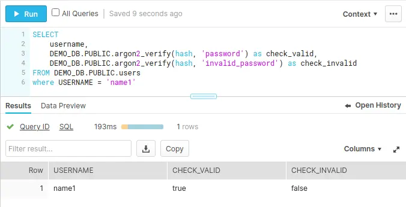

[Snowflake](https://www.snowflake.com/) seems like one of the hottest databases of the moment. Sorry, data warehouse. Tomayto, tomahto. Anyway, I wanted to give it a try and see how hard it is to add new SQL functions to it.

Although Snowflake supports [Javascript User Defined Functions](https://docs.snowflake.com/en/sql-reference/udf-js.html) I don't like using JS to do anything beyond basic scripts, but because it supports JS I expected it to also support [**WebAssembly**](https://webassembly.org/). In the past I've used WASM to build CARTO's [BigQuery Tiler](https://carto.com/bigquery/beta/) so the intention was to research if there was a similar way to add new methods to Snowflake.

There were a two things that I did not want to do as part of the prototype. First, I did not want to build a toy function that just multiplies 2 numbers using WebAssembly, as that is both slower and more complex than the equivalent Javascript; instead I wanted to use an already established open source library to do "meaningful" work. Secondly, I did not want to explore the underlying limits of the database or how to best use its resources; that is a whole different issue for a different day.

## The prototype

To start with, I chose to add some of the functions from the [Argon2](https://en.wikipedia.org/wiki/Argon2) library, winner of the [Password Hashing Competition](https://www.password-hashing.net/), with the idea of having a way to hash and verify passwords directly in Snowflake. It's true that the database is not the best place to do this but, you know what, that wasn't the point.

The good thing about this library is that the [reference implementation](https://github.com/P-H-C/phc-winner-argon2) is available in C and although there are a couple of wrappers for NodeJS, you can't use those in a limited environment like the one in the database. This gave me the perfect excuse to use WebAssembly. The problem that fits the solution.

### Setup

Even for a prototype I wasn't going to generate and load WebAssembly by hand so I needed something to do it for me, and that something was [Emscripten](https://emscripten.org/). Emscripten provides a simple way to compile a C or C++ library to WebAssembly optimizing the code and removing any unused functions and it generates something that we can easily import in Javascript, which is awesome when you want something that just works.

With the Argon2 reference code [in place](https://github.com/Algunenano/snowflake_wasm/tree/8827af8cda733503c0596e104bbfec07b4610d9d/argon2), building it is relatively simple so I set up a [Makefile](https://github.com/Algunenano/snowflake_wasm/blob/8827af8cda733503c0596e104bbfec07b4610d9d/Makefile) to do that. The important settings there are:

* [`-s WASM=1`](https://github.com/emscripten-core/emscripten/blob/8e11952d8e5be546421dac85f519716bc3389aaf/src/settings.js#L1080): I want to compile to WASM, not vanilla JS.
* [`-s ALLOW_MEMORY_GROWTH=1`](https://github.com/emscripten-core/emscripten/blob/8e11952d8e5be546421dac85f519716bc3389aaf/src/settings.js#L191): I don't want to worry about memory limits yet.
* [`-s WASM_ASYNC_COMPILATION=0`](https://github.com/emscripten-core/emscripten/blob/8e11952d8e5be546421dac85f519716bc3389aaf/src/settings.js#L1139): I don't want asynchronous compilation, instead just give me back control when everything is loaded and ready to use.
* [`-s SINGLE_FILE=1`](https://github.com/emscripten-core/emscripten/blob/8e11952d8e5be546421dac85f519716bc3389aaf/src/settings.js#L1412): Embed all resources, including the wasm code, into a single file. That way I only need to care about a standalone `.js` file.
* [`--post-js wasm_helpers.js`](https://emscripten.org/docs/tools_reference/emcc.html#emcc-post-js): Add the code from `wasm_helpers.js` to the resulting file. I'm going to use that auxiliary file to add wrappers to the WASM calls. That way I can simplify the code in the SQL body and use the same functions during testing.
* [`EXPORTED_FUNCTIONS`](https://github.com/emscripten-core/emscripten/blob/8e11952d8e5be546421dac85f519716bc3389aaf/src/settings.js#L783) and [`EXTRA_EXPORTED_RUNTIME_METHODS`](https://github.com/emscripten-core/emscripten/blob/8e11952d8e5be546421dac85f519716bc3389aaf/src/settings.js#L689): They define which functions we want to expose in the final JS file. Any functions that aren't declared here, or used by those functions, will be removed when we turn on optimizations.

Emscripten has many other options but these are the bare minimum to make my life as simple as possible.

### JS Wrapper

Using the compilation options defined above we generate an `argon2.js` file which contains all that we need, but in order to keep things simple and testable, I'll also be adding wrapper functions that hide the WASM calls and provide a pure JS API. Since both of the [2 functions](https://github.com/Algunenano/snowflake_wasm/blob/8827af8cda733503c0596e104bbfec07b4610d9d/wasm_helpers.js) are pretty similar, I'll only go through the shortest one:


```js
function wasm_argon2_verify(hash, password) {
    if (!password || !hash) return false;

    const hash_length = lengthBytesUTF8(hash);
    const wasm_hash_buffer = _malloc(hash_length + 1);
    stringToUTF8(hash, wasm_hash_buffer, hash_length + 1);

    const password_length = lengthBytesUTF8(password);
    const wasm_password_buffer = _malloc(password_length + 1);
    stringToUTF8(password, wasm_password_buffer, password_length + 1);

    const type = 1; // Argon2_i -- Needs to match the one used in wasm_argon2_hash
    const verify_result = _argon2_verify(wasm_hash_buffer, wasm_password_buffer, password_length, type);

    _free(wasm_password_buffer);
    _free(wasm_hash_buffer);

    if (verify_result !== 0 && verify_result !== -35) {
        throw `Could not verify argon2 hash (Error ${verify_result}). Inputs: ${hash} -- ${password}`;
    }

    return verify_result == 0;
}
Module["wasm_argon2_verify"] = wasm_argon2_verify;
```

This can be broken into several steps:

  * Convert JS Strings into UTF-8 Strings. This requires us to _malloc_ enough memory and copy the string using [`stringToUTF8`](https://emscripten.org/docs/api_reference/preamble.js.html#stringToUTF8).
  * Call the **Argon2** function with the appropriate parameters. Note that the C function is called `argon2_verify` but it must be preceded by an underscore: `_argon2_verify`.
  * Clean up the allocated memory. Failure to do so would leak memory.
  * Handle the result.
  * Ensure the function is not optimized away by adding it to the `Module`. There might be a simpler way to do this, but I haven't found it yet.

With this, [the final file](https://github.com/Algunenano/snowflake_wasm/blob/8827af8cda733503c0596e104bbfec07b4610d9d/argon2.js#L1) contains the functions, `wasm_argon2_hash` and `wasm_argon2_verify`, that we can use in Javascript to hash a password and verify it using Argon2.

### Test

 I'm using a simple [Node script](https://github.com/Algunenano/snowflake_wasm/blob/8827af8cda733503c0596e104bbfec07b4610d9d/simpletest.js) that imports the functions and verifies the output to test the resulting file. Note that I am not importing the `argon2.js` file with the usual `import` directive because that isn't how BigQuery loads files and instead it loads everything in the global namespace. As I'm treating BigQuery and Snowflake as the same thing, I'm using what worked for me before to replicate the JS environment of the database.

```bash
$ node simpletest.js 
Should be ok:
true
true
Should be ko:
false
false
```
Great, the JS example is loading the WASM code, executing it and getting the expected result. Let's move into Snowflake itself.

### Snowflake UDF

From [Snowflake's documentation](https://docs.snowflake.com/en/sql-reference/udf-js.html) I understand that the only way to execute JS code is to put it in the function body like this:

```sql
-- Create the UDF.
CREATE OR REPLACE FUNCTION array_sort(a array)
    RETURNS array
    LANGUAGE JAVASCRIPT
AS
$$
  return A.sort();
$$;
```

As we need the contents of `argon2.js` I created [a template](https://github.com/Algunenano/snowflake_wasm/blob/8827af8cda733503c0596e104bbfec07b4610d9d/template.sql) with functions that look like this:

```sql
CREATE OR REPLACE FUNCTION argon2_hash(password_input STRING, diffsalt_input STRING) 
  RETURNS STRING
  LANGUAGE JAVASCRIPT
AS
$$
  @@WASM_FILE_CONTENTS@@
  return wasm_argon2_hash(PASSWORD_INPUT, DIFFSALT_INPUT);
$$;
```

Then all I need to do is to replace `@@WASM_FILE_CONTENTS@@` with the contents of `argon2.js` and execute the SQL queries in Snowflake. The Makefile generates an `argon2.sql` file with the replacement, so I can copy and paste that or load the file using the [`snowsql`](https://docs.snowflake.com/en/user-guide/snowsql-use.html#running-in-a-session-source-or-load-commandl) client and confirm that it works:

```sql
SELECT argon2_hash('password123', 'long enough salt') as hash
```
<p></p>

```
$argon2i$v=19$m=8,t=2,p=1$bG9uZyBlbm91Z2ggc2FsdA$/9x6WwGdYsFJr6q4ZBIYKwFzjIiE0VEN5EazdB9SFDY
```

The verification step also works:

```sql
SELECT argon2_verify(argon2_hash('password123', 'long enough salt'), 'wrong_password') as verify
UNION ALL
SELECT argon2_verify(argon2_hash('GOODpassword', 'long enough salt'), 'GOODpassword') as verify
```
<p></p>

| **Row** | **VERIFY** |
| 1 | false |
| 2 | true |

As the hash contains all the information needed, we can use that column to verify passwords:

{: .mx-auto.d-block :}

## Parting thoughts

The process was relatively easy since it is really similar to BigQuery UDFs but it feels less polished:

* You are forced to inline the whole JS code as part of the SQL function declaration. BigQuery allows you to load a JS file from Cloud Storage, which makes things cleaner and simpler.
* The parameters of the SQL function need to be used in upper case in the JS code. I'm sure there is a reason to justify it, but that looks like a very arbitrary thing to do.
* It took me less than an hour from the moment I first used Snowflake to the moment I found the first bug. That doesn't speak well of the platform.
    * `INSERT INTO TABLE (c1, c2) VALUES ('xxx', jsfunction('a', 'b'));` will throw a `SQL compilation error`.
    * `INSERT INTO TABLE (c1, c2) SELECT 'xxx' as c1, jsfunction('a', 'b') as c2` can be used as a workaround.

You can use WebAssembly in Snowflake but I don't expect the experience to be as good as with BigQuery. On the other hand, Snowflake supports the creation of [external functions](https://docs.snowflake.com/en/sql-reference/external-functions-introduction.html) that connect to external services, so maybe they expect you to use AWS Lambda or some other service to add new functions like this. I haven't tested it, but I wouldn't expect it to be as fast as doing the work directly in the database without any extra data transfer.

All the code used is available in a [Github repo](https://github.com/Algunenano/snowflake_wasm/settings).
